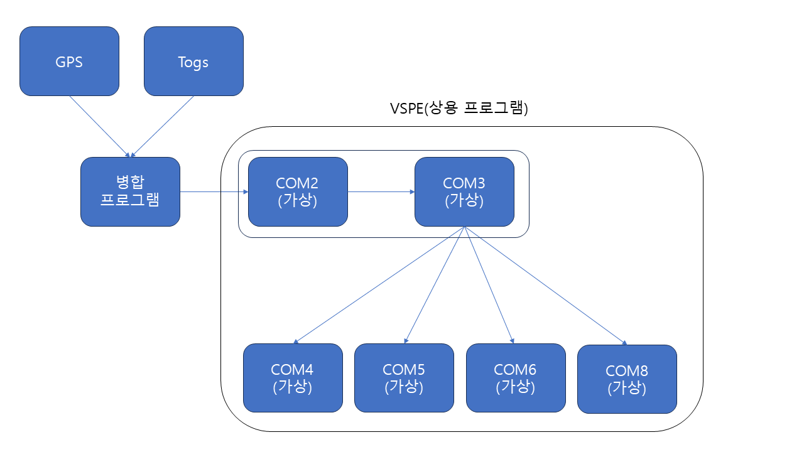
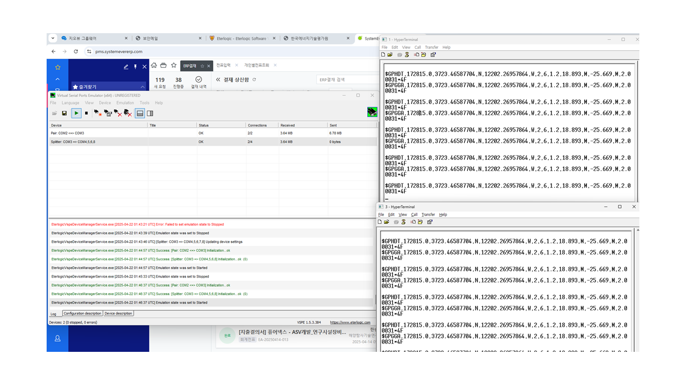

### VSPE 와 Cpp 자체 프로그램을 이용한 시리얼 데이터 병합 프로그램

1. 목적
    - 기존 이용하려는 모션 센서에는 GPS 데이터와 모션 데이터를 합쳐서 나오는 게 불가능하였고 이를 해결하기 위해 최대한 간편한 방법으로 구현한 방법이다.
    - 해당 목적을 달성하기 위해 시작하였던 프로젝트의 경우 제조사의 문의 결과 펌웨어 업데이트시 INS 모드로 업데이트 후 병합이 가능하다고 한다. 펌웨어 파일을 받은 후 모션 센서에서 출력하기 위한 테스트 예정이다.(5/4)

2. 구성 및 구성 이유
    - 구성도
    
    - 구성 이유
        - 상용 프로그램인 VSPE가 사용되어야한다는 금액적인 부분이 있었지만 오랫동안 유지보수 되었던 프로그램인 만큼 안정성이 좋을 것이라고 생각하였고 어차피 한 개의 PC에 사용되어야 한다면 소프트웨어 적으로 모든 것을 처리 후 PC에서 바로 포트를 잡을 수 있도록 하고 싶었다.- 또한 스플릿 기능을 이용하여 원하는 만큼 포트를 추가해줄 수 있으므로 회사에서 이용 중인 Y 케이블보다는 정보의 신뢰성이 더 높을 것으로 생각되었다.

3. 결과
    
    - A, B 의 데이터를 받아 합쳐서 가상화된 페어 포트와 스플릿된 포트로 출력하였고 데이터도 끊김 없이 잘 나오고 있다.
    - 진행한 프로젝트 중 제일 안정적일 것으로 생각이 되나 하드웨어 적으로 분배하시길 원하서 해당 프로젝트는 여기까지가 마무리이다.
    - 개인적인 의견으로는 마지막만 하드웨어적인 출력을 원하시면 Multi-4port (USB to serial) 을 이용하여 각 포트를 잡고 연결하여도 좋을 것 같다는 생각이다.