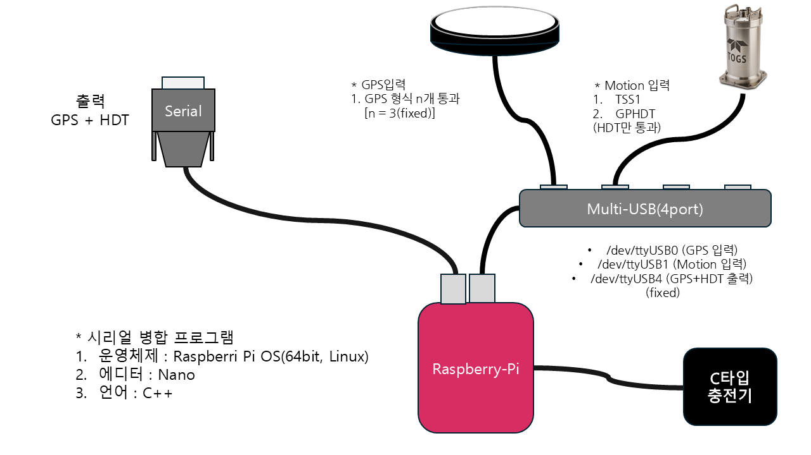

# 시리얼 병합 프로그램 - 라즈베리파이5를 이용한 리눅스 환경 프로그램 제작

1. 목적
    - 시리얼 병합을 수행하기 위한 리눅스로 제작한 프로그램이다. PC가 아닌 어떠한 장치에 들어가서 하드웨어 적으로 출력을 했으면 좋겠다고 하셨고 포트는 1개만 나오면 된다고 하여 라즈베리파이5 14,15 GPIO 핀이 UART로 출력된다는 사실을 알고 해당 프로젝트를 준비하였다.

2. 구성도 및 구성 이유
    - 구성도
    
    - 프로그램의 오류 발생의 주된 원인은 사람에 의한 실수가 대부분이라고 생각한다. 나 조차도 내가 만든 프로그램을 100% 믿지 못하는데 말이다. 라벨지를 이용하여 멀티 포트에 GPS, MOTION 으로 입력 포트를 고정 후 하드 코딩으로 받게 해두었다. 2개의 데이터는 rasp로 들어가며 GPS 포트는 저장 후 통과, 모션 센서는 HDT만 파싱 후 출력으로 하였고 raspi의 UART 기능을 이용하여 병합 데이터를 출력하였다.
    - TTL 신호와 RS-232 방식의 신호 데이터는 전압 레벨이 다르다. TTL 신호는 0 ~ 5를 이용하지만 RS-232 방식은 -12 ~ 12 를 이용하며 노이즈 방지를 위해 -3.3 ~ 3.3V는 신호를 무시한다. 즉 0의 신호는 신호로 인식되지 않으며 신호가 제대로 전달되지 않는다. 이를 해결하기 위해서는 USB to TTL 혹은 RS-232 to TTL 장치가 필요하며, 아니면 MAX 와 같은 칩을 이용하여 직접 회로를 구성하여야 한다.

3. 결과
    - GPS, Motion 의 각 각의 테스트만 하여 성공은 하였으나 아직 두개를 합쳐서 테스트를 해본 적은 없다. 추후 테스트 후 결과를 업데이트, 만약 오류가 발생한다면 결과 2.. 3.. 이런식으로 업데이트할 예정이다.